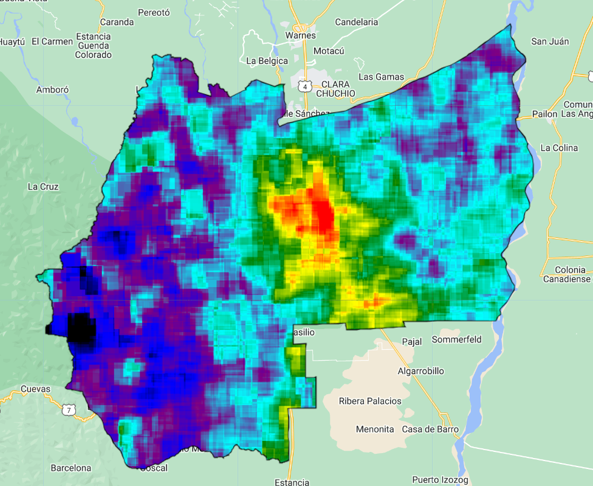
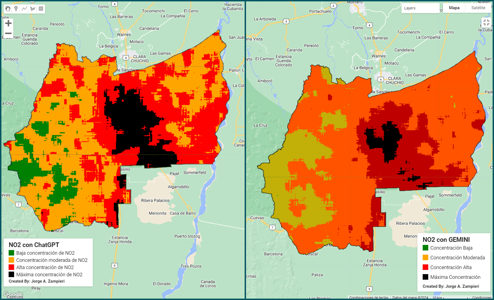
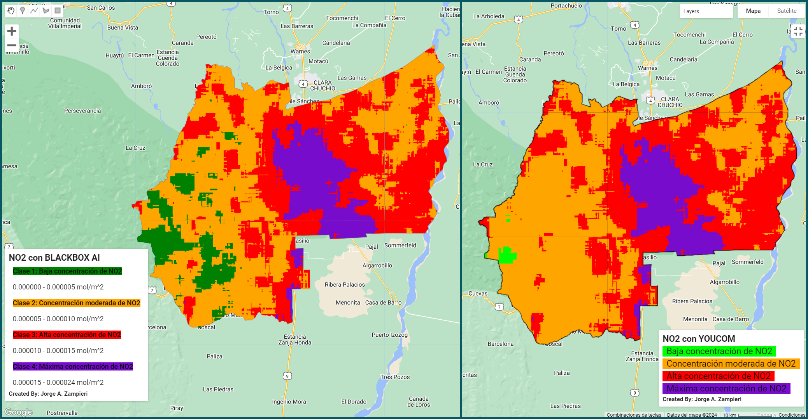

# IAs para el monitoreo de la calidad del aire

Este proyecto tuvo como objetivo principal comparar a 3 IAs diferentes y un asistente virtual (ChatGPT, Gemini, Blackbox AI y Youcom) para el analisis de datos geoespaciales en tema de la calidad del aire con datos de TROPOMI (NO2 principalmente), Para ello, se les dió 3 instrucciones. EStos fueron los resulatdos:

###### Resultado de ChapGPT y Gemini

###### Resultado de BlackBox y Youcom

### Recursos
Para explorar el potencial de las diferentes IAs, se tuvo una base a patir de dos capacitaciones:
* El curso sobre [Introduction to Geospatial Data Analysis with ChatGPT and Google Earth Engine](https://wlc.unu.edu/courses/course-v1:UNU-INWEH+INWEH-20+2023_T4/about "Curso"), brindado por [UNU Institute for Water, Environment and Health](https://unu.edu/inweh "UNU Institute for Water, Environment and Health")
* Taller en "Mejora tu productividad con IA" brindado por [Google Activate](https://www.linkedin.com/company/activatecongoogle/posts/?feedView=all "Google Activate")

### Inteligencias Artificiales
* [Chat GPT](https://chatgpt.com/?ref=gptalk.ru "Chat GPT")
* [Gemini](https://gemini.google.com/?hl=es "Gemini")
* [Blackbox AI](https://www.blackbox.ai/ "Blackbox AI")
* [YouCom](https://you.com/ "YouCom")

### Datos utilizados
* [Límites internacionales de Provincias/Distritos](https://developers.google.com/earth-engine/datasets/catalog/FAO_GAUL_SIMPLIFIED_500m_2015_level2 "Límites internacionales de Provincias/Distritos")
* [TROPOMI - NO2](https://developers.google.com/earth-engine/datasets/catalog/COPERNICUS_S5P_OFFL_L3_NO2 "TROPOMI - NO2")

>Create by: Jorge A. Zampieri
